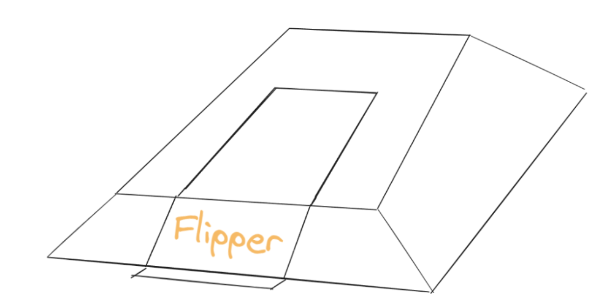
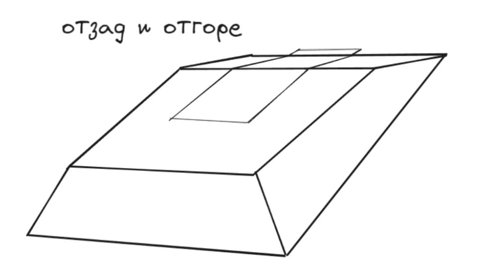

# Barbie Bot - BattleBot

## Дизайн и Механика
Battle Bot до 25 кг с пневматично flipper оръжие

фиг. 1 - Рисунка на боен робот BarbieBot

фиг. 2 - Рисунка на боен робот BarbieBot, погледнат отзад и отгоре

Форма на трапец (погледнато от страни). Задната част е по-висока от предната

## Радио контрол
RC комуникация
FlySky FS-I6X 10 канално радиоуправление с приемник FS-iA10B

### Описание на приемника:
Има двойна антена за надеждна безжична комуникация.
Редицата от пинове в горната част е маркирана като "SENS" за свързване на сензори.
До тях са три комплекта пинове за захранване (+), земя (-) и сигнал (S). 
Приемникът поддържа различни режими на изходящи сигнали: PWM, PPM, S.bus и i.bus, които могат да бъдат избирани чрез менюто RX-SETUP на предавателя.

## Задвижване
То се осъществява благодарение на контролите FlySky FS-I6X и приемника FS-iA10B.

2 постояннотокови четкови мотора 
4 гуми, еднакви по размер
2 по 2 свързани гумите към всеки мотор

## Оръжие
Пневматичен флипер

## Захранване
Battle Bot-a ще се захранва от една батерия. Видът батерия, който избрахме да използваме е литиево-полимерна, тъй като те са по безопасни от другите и могат много по-трудно да се взривят. Освен така са много тънки и леки, което е много полезно за нашата цел.